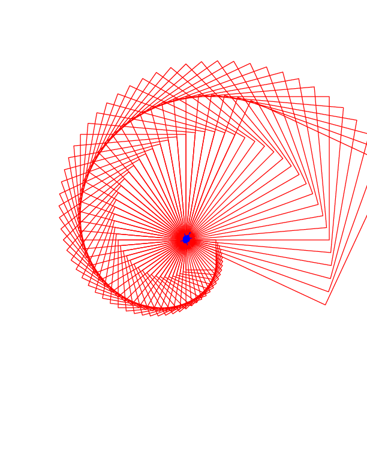

# Introduction to mytools module
my own tools for gui, math calculations and so on. If you have a linux or Macos environment, you should move the mytools
directory to a directory within PYTHONPATH(you can edit it in a .bashrc
or .zshrc file). If you have a windows environment, you can edit PYTHONPATH
following the guide as it shows in the link: 
https://blog.csdn.net/Tona_ZM/article/details/79463284

# class TurtlePlay
## User Guide
It is easy to use TurtlePlay, for example:
```python
from mytools imort TurtlePlay
play = TurtlePlay()
play.test()
```
After running the above code, you will see an animation.

Finally,  we will get a figure as the following shows:



# Class NameAll

## User Guide

It is easy to use class NameAll, for example:

```python
from mytools imort NameAll
test = NameAll()
test.run()
```

